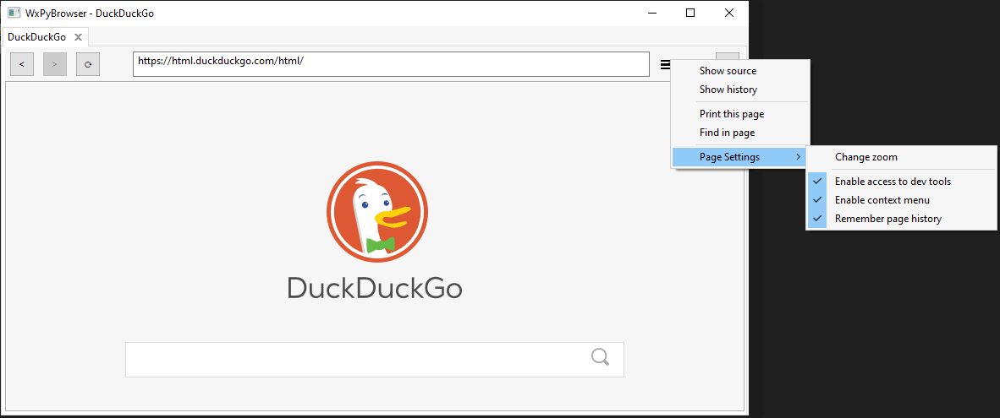

How to Use:
===========

* Create and activate a virtual environment:

    virtualenv venv
    
    venv\Scripts\Activate

* Install dependencies:

	pip install -r requirements.txt
	
* Run the GUI demo:

	python main.py
    
    
Note:
----
This Demo is taken from this repository: 
https://github.com/Andereoo/WxPyBrowser

Sample:
----
Web Browser:

